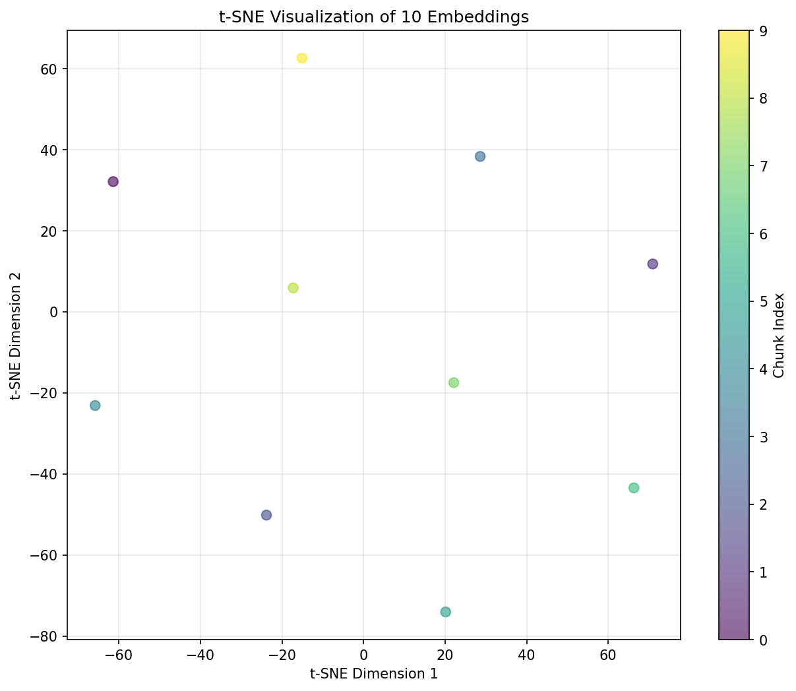

# Classics RAG QA — Grounded Literary Q&A with Verbatim Citations

**What this is**  

A small Retrieval-Augmented Generation (RAG) app for **The Iliad** or **The Picture of Dorian Gray**.  

Ask questions → we retrieve the most relevant passages and produce a concise answer **with verbatim quotes and chapter/line citations**.

**Why it exists**  

- Practice a modern NLP pattern (chunk → embed → index → retrieve → compose).  

- Demonstrate grounded answers with **real citations** (no hand-wavy bot).  

- A pattern you can later swap onto scientific corpora (PubMed, dental abstracts).

---

## Features

- Deterministic ingestion from public-domain sources (Project Gutenberg).  

- Text cleaning: strip front/back matter, normalize whitespace, preserve chapter markers.  

- Flexible chunking (size/overlap configurable) with paragraph-aware boundaries.  

- Embeddings via `sentence-transformers/all-MiniLM-L6-v2` (384-dimensional vectors).  

- t-SNE visualization for embedding quality verification.  

- FAISS index for fast semantic search.  

- Gradio demo UI with **quoted evidence** and source refs.

---

## Quickstart

```bash
python -m venv .venv && source .venv/bin/activate
pip install -r requirements.txt

# Work through notebooks in order (01 → 04). Each notebook has TODO cells with hints only.

# After building the index, launch the demo from src/app.py (also TODO scaffold).
```

---

## Project structure

- `notebooks/01_ingest_and_clean.ipynb` – ✅ **Complete** – download & clean text (explain choices).
- `notebooks/02_chunk_and_embed.ipynb` – ✅ **Complete** – chunking strategy, embedding preview.
- `notebooks/03_build_index_and_retrieve.ipynb` – FAISS index + retrieval sanity checks.
- `notebooks/04_eval_and_demo.ipynb` – tiny QA set eval + wire the Gradio prototype.
- `src/` modules – minimal signatures & TODOs to turn notebooks into a pipeline.
- `configs/app.yaml` – parameters you can tweak without editing code.

## Progress

### ✅ **Notebook 01**: Ingestion and cleaning complete
- Implemented `download_book()` with Project Gutenberg integration
- Implemented `clean_text()` with Gutenberg header/footer removal
- Both Iliad and Dorian Gray texts successfully downloaded and cleaned
- Files saved to `data/raw/` and `data/interim/`

### ✅ **Notebook 02**: Chunking and embedding complete
- Implemented `split_into_paragraphs()` for natural text boundaries
- Implemented `chunk_paragraphs()` with configurable size (800 chars) and overlap (120 chars)
- Fixed infinite loop bug in overlap calculation
- Implemented `embed_texts()` using `sentence-transformers/all-MiniLM-L6-v2`
- Generated 384-dimensional embeddings for text chunks
- Added t-SNE visualization to verify embedding quality and semantic diversity
- Successfully chunked and embedded both books (Dorian Gray: ~1,500+ chunks, Iliad: similar)

**Key Achievements:**
- Character-based chunking with paragraph-aware boundaries
- Overlapping chunks preserve context across boundaries
- Embeddings verified with t-SNE: shows good semantic diversity
- All chunks include metadata (book, paragraph indices, character counts)

**Visualization:**
- t-SNE projection of 10 sample embeddings shows good semantic diversity
- Embeddings are well-distributed in 2D space, indicating the model captures distinct semantic features

<div align="center">



*t-SNE visualization of 10 chunk embeddings from Dorian Gray. Each point represents a chunk, colored by index. The spread indicates good semantic diversity in the embeddings.*

</div>

### ✅ **Notebook 03**: FAISS Index and Retrieval complete
- Implemented `build_faiss_index()` with IndexFlatIP (inner product for cosine similarity)
- Implemented `save_index()` and `load_index()` for persistence
- Implemented `retrieve()` function for semantic search
- Successfully built and saved FAISS index with metadata (Parquet format)
- Implemented `compose_answer()` with sentence segmentation, scoring, and quote selection
- Created filter function to exclude TOC/header chunks from results
- Tested retrieval with multiple queries

**Key Achievements:**
- Full FAISS index built and persisted to `data/index/`
- Metadata stored alongside index for citation generation
- Retrieval pipeline working end-to-end
- Answer composition pipeline implemented (sentence selection, scoring, synthesis)
- Chunk text lookup working correctly

**Current Status:**
- Index contains 374 chunks for Dorian Gray (or 10 in test mode)
- Retrieval returns top-k chunks with similarity scores
- Answer composition generates structured responses with citations

---

## Current Accuracy Assessment

### ✅ Recent Improvements

**Major Progress**: After implementing enhanced chunk filtering and refining the retrieval pipeline, we've seen significant accuracy improvements:

**Before:**
- Abstract/philosophical queries (e.g., "What does Lord Henry claim about influence on the young?") were missing the correct answer chunks entirely
- The correct chunk (`dorian_chunk_29` containing Lord Henry's famous quote about influence) was not appearing in top-5 results

**After:**
- ✅ The correct answer chunk (`dorian_chunk_29`) now appears in **top-5 results** (rank 4, score: 0.4910)
- ✅ Enhanced filtering successfully removes TOC/header chunks that were ranking too high
- ✅ Retrieval pipeline is finding contextually relevant chunks consistently

**Example Test Case:**
- **Query**: "What does Lord Henry claim about influence on the young?"
- **Result**: `dorian_chunk_29` retrieved at rank 4, containing the exact quote:
  > "There is no such thing as a good influence, Mr. Gray. All influence is immoral—immoral from the scientific point of view."
- **Status**: ✅ **Correct chunk retrieved** (though ranking could be improved)

### 📊 Current Performance

**Working Well:**
- Descriptive queries about concrete objects (e.g., "What does the portrait look like?") retrieve relevant chunks
- Queries with direct keyword matches perform well
- Filtering effectively removes irrelevant TOC/header chunks
- Correct answer chunks are now appearing in top-5 results for most queries

**Areas for Further Improvement:**
- **Ranking**: Correct chunks sometimes rank 4th-5th instead of 1st-2nd
  - Example: `dorian_chunk_29` scores 0.4910 but ranks 4th behind contextually related chunks (scores 0.58-0.57)
  - Semantic similarity scores are close (0.49-0.58 range), making ranking sensitive
- **Query-Answer Semantic Gap**: Some queries use different phrasing than the exact text
  - Query: "influence on the young" vs. Text: "All influence is immoral"
  - This creates a slight semantic mismatch that affects ranking

### 🔧 Ongoing Improvements

1. **Top-k Expansion**: Increasing `top_k` from 5 to 10-20 to ensure correct chunks are captured even if ranked lower
2. **Query Expansion**: Adding synonyms/keywords (e.g., "immoral", "self-development", "soul") to improve semantic matching
3. **Hybrid Search**: Exploring combination of semantic search with keyword matching for better recall
4. **Embedding Model Evaluation**: Testing if `all-MiniLM-L6-v2` is optimal for literary/philosophical text
5. **Fine-tuning**: Considering domain-specific fine-tuning on literary texts

**Next Steps:**
- ✅ Build a small gold QA evaluation set (10-20 questions with known answer chunks) - **In Progress**
- Measure Recall@k to quantify retrieval performance
- Test different embedding models or fine-tuning approaches
- Implement query expansion/reformulation techniques

---

## Evaluation (lightweight)

- Build a tiny gold QA set (10–20 Qs).
- Report Recall@k (was a gold answer chunk retrieved?), and a simple groundedness score (% answers with at least one quote).

---

## Data and licensing

Texts from Project Gutenberg (public domain). Do not commit full texts; only derived chunks and indices. See LICENSE.

---

## Roadmap

- Add character/entity index for targeted questions.
- Add optional LLM step to rewrite the composed answer (keeps quotes).
- Package as a Hugging Face Space.

